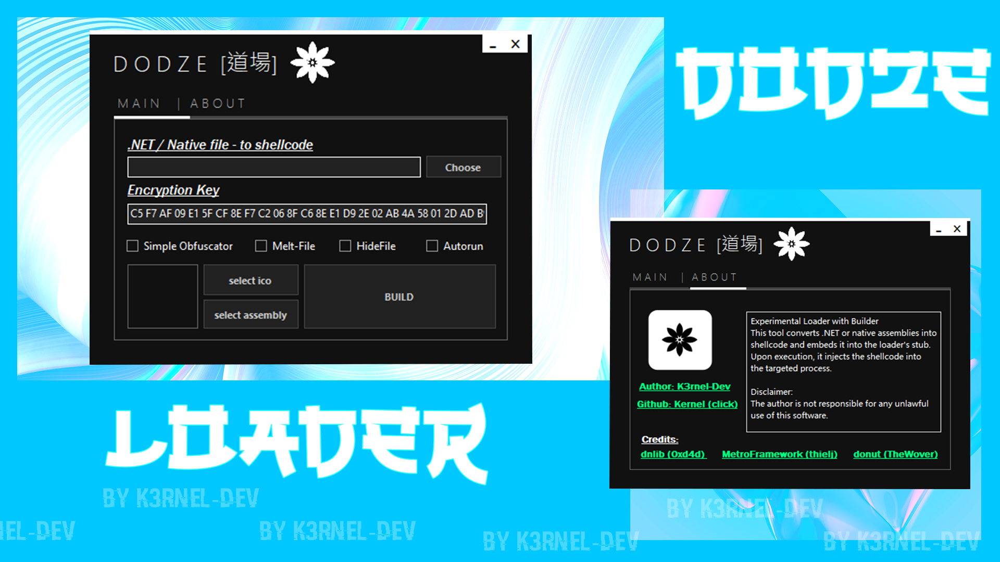
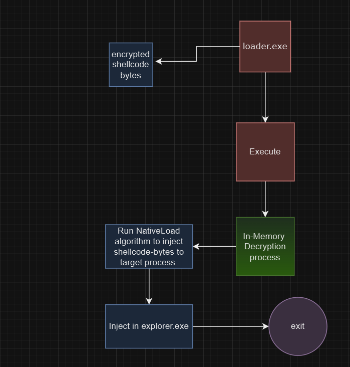
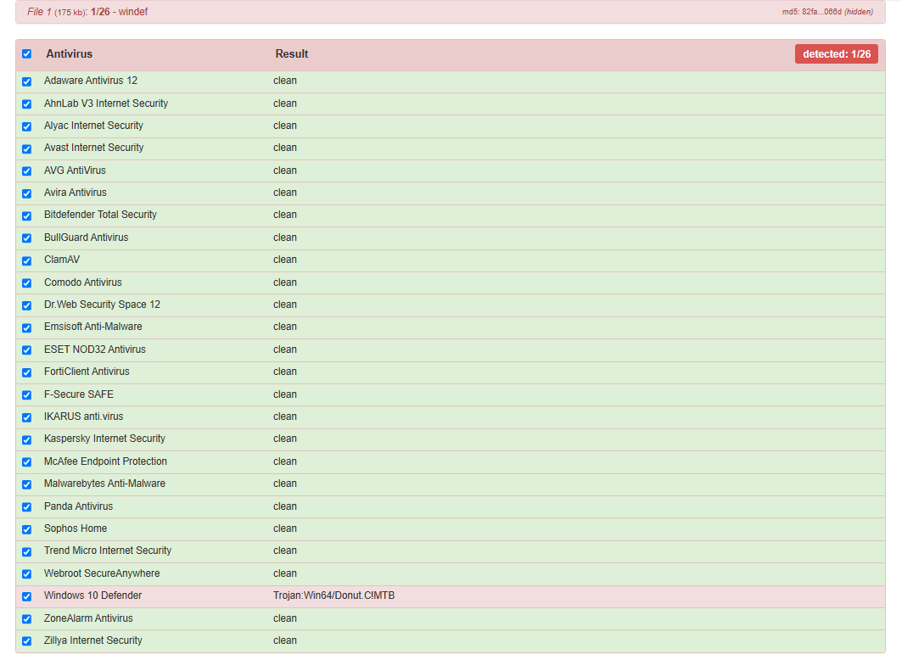

# 🛡️ <b>DODZE SHELLCODE LOADER & BUILDER (.NET)</b> 


</img> 



---

### > **[⬇️ Download for Windows](https://github.com/K3rnel-Dev/ShellcodeLoader/releases/download/Build/Binaries.rar)** 

---

# ⚔️ About

>**DODZE Loader** is an shellcode loader with builder, the operating principle is quite simple, first your executable file is taken, then using the donut module it is converted into shellcode, then my builder encrypts the executable bytes of the shellcode, bringing them into an incorrect format using the xor crypto-algorithm, then the key and the encrypted bytes themselves are placed in the stub, and the stub in turn performs actions to decrypt the executable bytes of the shellcode and its subsequent injection into the legitimate explorer process, also included as additional functions such as: 

- 🔥 **Self-Removal (Melting)**: Removes itself from the disk after execution.
- 🌆 **HideFile**: Changes the file's attributes to hidden.
- 🚀 **Autorun**: Adds a file to startup.
- ⚙️ **Conditional Compilation**: Allows the builder to include only the features and options chosen by the user, making the final build more streamlined.
- 🔒 **Custom Renaming and Obfuscation**: Includes customizable renaming of functions and string encryption to make the code less readable and harder to analyze.

# 📒 Loader principle diagram
> 

# 🖥️ Detection
>

## ⚠️ **Disclaimer**: 
```
This project is for educational purposes only, intended for studying malware and security techniques. The author is not responsible for any malicious use of this software.
```
<br>

# ⭐ Credits 

- **Author**: <a href="https://github.com/k3rnel-dev">@K3rnel-Dev</a>
- **dnlib**: A library for manipulating .NET assemblies.  
  GitHub: [https://github.com/0xd4d/dnlib](https://github.com/0xd4d/dnlib)
- **donut**: Executable file to shellcode <a href="https://github.com/TheWover/donut">converter</a>  
- **MetroFramework**: <a href="https://thielj.github.io/MetroFramework/">Library</a> for program customization and design

---
